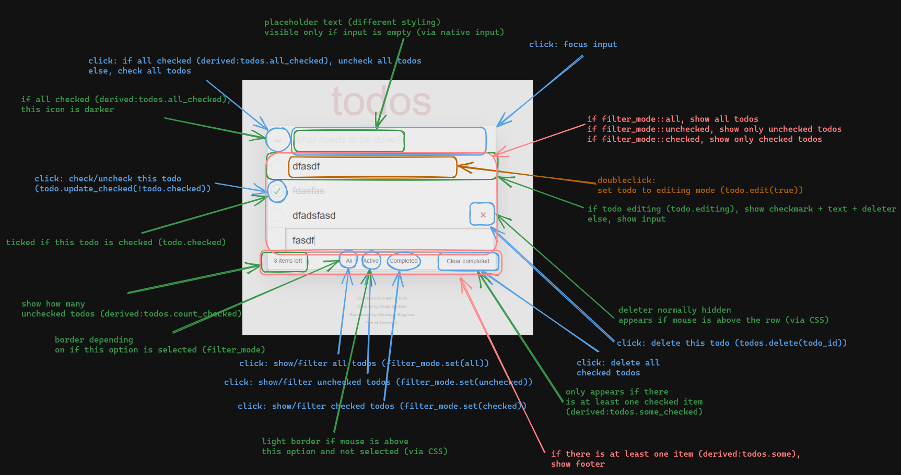

# TODOMVC in Bevy

TODO:



## Run

native:
```rs
cargo r --release
```

wasm:
```rs
cargo install wasm-server-runner
RUSTFLAGS=--cfg=web_sys_unstable_apis cargo r --release --target wasm32-unknown-unknown
```